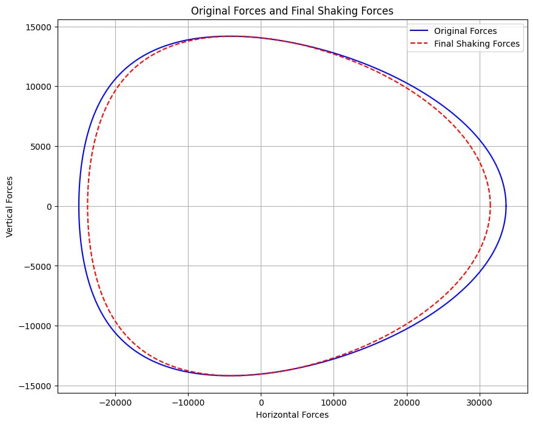

# slider-crank-balancing
Dynamic balancing optimization of a slider-crank mechanism using Python (optional bonus coursework).

Python script that analyzes and minimizes the shaking forces of a slider-crank mechanism, developed as an optional bonus assignment in the Dynamics of Machinery course — attempted by only a small number of students in the class.

# What it does:

Computes the primary and secondary shaking forces of the mechanism using a lumped-mass model of the crank and connecting rod
Searches across a range of counterweight balancing factors to find the value that minimizes the force-ellipse area (i.e., reduces overall shaking force)
Plots the original vs. balanced force loci for comparison

# Tools:

Python, NumPy, SymPy, Matplotlib

# Background:

This was an optional bonus assignment in the Dynamics of Machinery course, taken on by only a handful of students.
